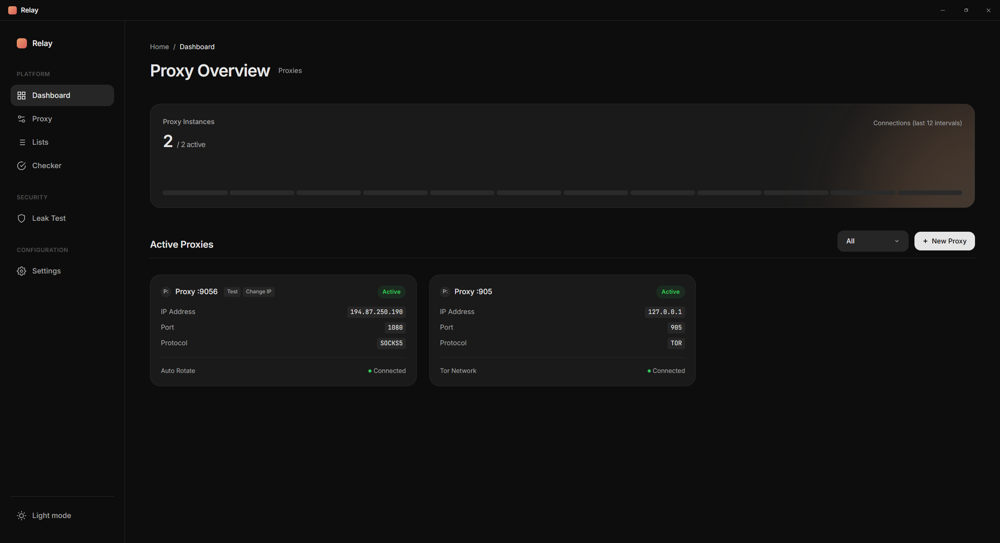
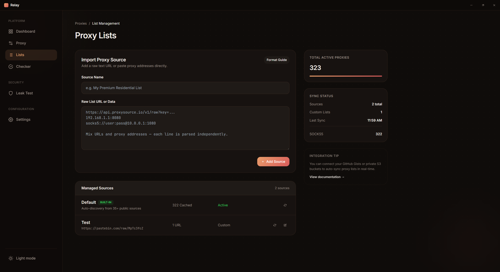
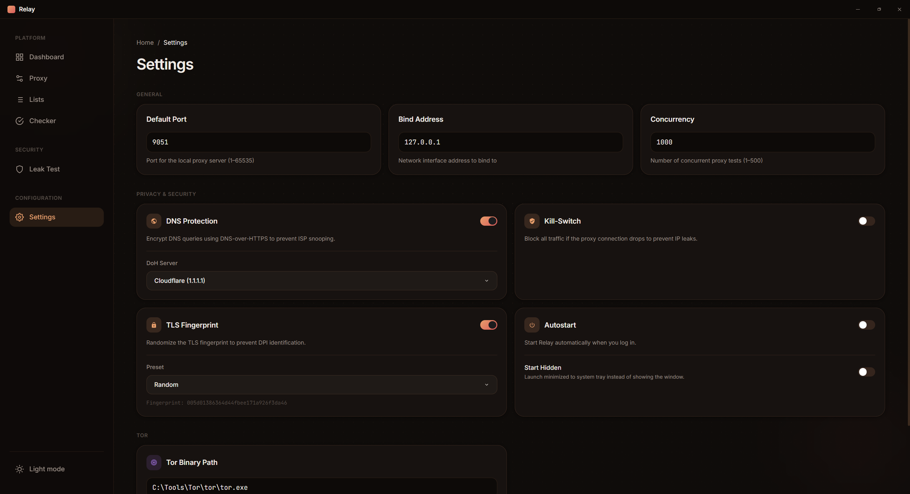

<div align="center">
  

  <h1>Relay</h1>

  <p><strong>Free SOCKS5 proxy manager with auto-rotation</strong></p>

  <p>
    Relay automatically finds free SOCKS5 proxies from 35+ public sources, tests them for speed and anonymity, and runs a local proxy server with seamless upstream rotation — all wrapped in a clean desktop interface.
  </p>

  <p>
    
    
    
    
    
  </p>
</div>

---

## Screenshots

### Dashboard


### Proxy Lists


### Settings


---

## Features

- **Auto-discovery** — fetches proxies from 35+ public sources automatically
- **Proxy testing** — checks speed, latency, and anonymity of each proxy
- **Local proxy server** — spins up a local SOCKS5 server on any port you choose
- **Auto-rotation** — seamlessly rotates upstream proxies on a configurable interval
- **Proxy chains** — chain multiple proxies together for extra anonymity
- **Tor integration** — route traffic through the Tor network
- **DNS Protection** — encrypts DNS queries via DNS-over-HTTPS (DoH) to prevent ISP snooping
- **TLS Fingerprint randomization** — defeats DPI-based fingerprinting
- **Kill Switch** — blocks all traffic if the proxy connection drops to prevent IP leaks
- **Leak Test** — checks for DNS, WebRTC, and IP leaks
- **System tray** — runs silently in the background with a tray icon
- **Autostart** — launches automatically when you log in

---

## Tech Stack

| Layer | Technology |
|---|---|
| Desktop shell | [Tauri 2](https://tauri.app/) |
| Frontend | React 19, TypeScript, Vite |
| Styling | Tailwind CSS |
| Backend | Rust (Tokio async runtime) |
| Networking | Reqwest, tokio-socks, Rustls |
| Routing | React Router DOM 7 |

---

## Getting Started

### Prerequisites

- [Node.js](https://nodejs.org/) 18+
- [Rust](https://www.rust-lang.org/tools/install) (stable toolchain)
- [Tauri CLI prerequisites for Windows](https://tauri.app/start/prerequisites/)

### Development

```bash
# Install frontend dependencies
npm install

# Start in development mode (opens the app with hot-reload)
npm run tauri dev
```

### Build

```bash
# Produce a release installer
npm run tauri build
```

The installer will be output to `src-tauri/target/release/bundle/`.

---

## Usage

1. Launch **Relay** — it will appear in your system tray.
2. Open the **Dashboard** to see active proxy instances.
3. Go to **Lists** to add custom proxy sources (URL or raw text) or use the built-in auto-discovery.
4. Use the **Checker** to test proxies for speed and anonymity.
5. Create a proxy via **+ New Proxy**, choose a port, and connect.
6. Enable **Auto Rotate** to automatically switch upstreams at a set interval.
7. Configure DNS Protection, Kill Switch, and TLS Fingerprint in **Settings**.
8. Run the **Leak Test** to verify no DNS or IP leaks.

---

## Configuration

All settings are available in the **Settings** page inside the app:

| Setting | Description |
|---|---|
| Default Port | Local SOCKS5 server port (1–65535) |
| Bind Address | Network interface to bind to |
| Concurrency | Number of concurrent proxy tests (1–500) |
| DNS Protection | DNS-over-HTTPS via Cloudflare / Google / custom |
| Kill Switch | Block all traffic if proxy drops |
| TLS Fingerprint | Randomize TLS fingerprint to bypass DPI |
| Autostart | Launch Relay at system login |
| Start Hidden | Minimize to tray instead of showing window |
| Tor Binary Path | Path to `tor.exe` for Tor integration |

---

## License

[MIT](LICENSE)
